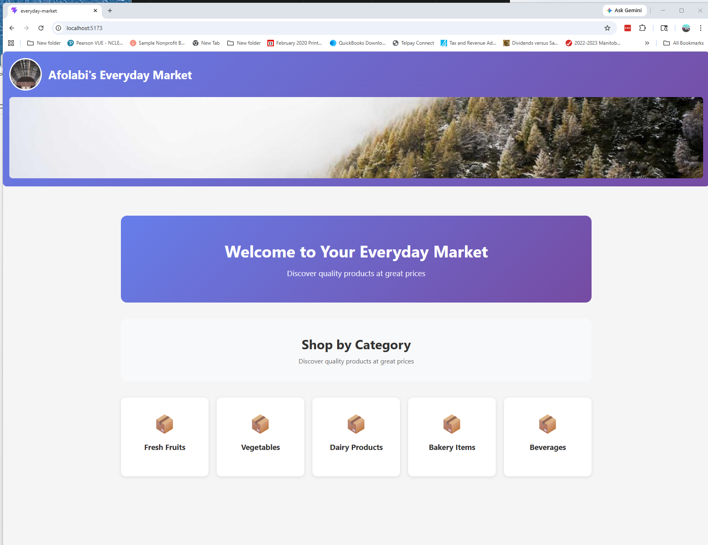
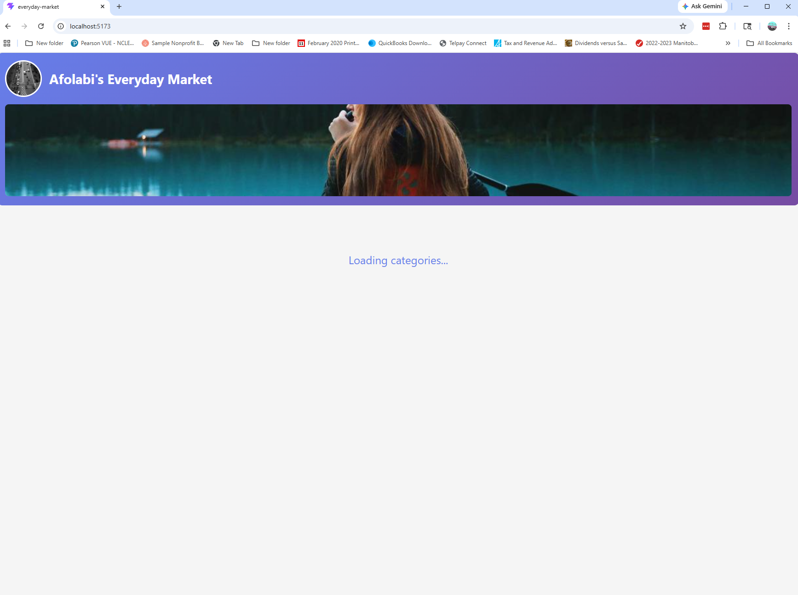
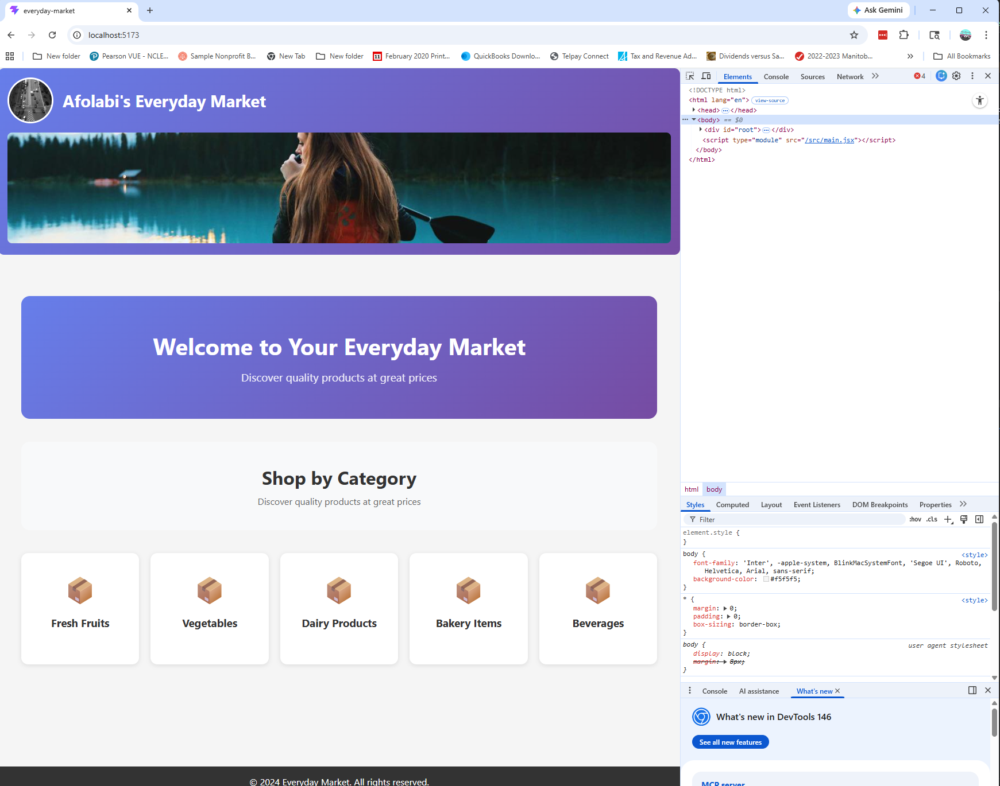

# Everyday Market App - Testing Document

## Test Information

- **Student Name:** Olabisi Afolabi
- **Test Date:** May 20, 2026
- **Browser:** Chrome
- **Framework:** React 18+ with Vite

## Screenshots

### Screenshot 1: Main Application


*Figure 1: Everyday Market App showing header with name and 5 categories*

### Screenshot 2: Loading State


*Figure 2: Loading spinner during 2-second simulated API delay*

### Screenshot 3: Console Log


*Figure 3: Console showing "Selected category: Fresh Fruits"*

## Test Steps Performed

| Test # | Test Description | Expected Result | Status |
|--------|-----------------|----------------|--------|
| 1 | Run `npm run dev` | Server starts at localhost:5173 | ✅ PASS |
| 2 | Header displays name | Shows "Olabisi Afolabi's Everyday Market" | ✅ PASS |
| 3 | Loading state appears | "Loading categories..." for 2 seconds | ✅ PASS |
| 4 | 5 categories load | Fresh Fruits, Vegetables, Dairy, Bakery, Beverages | ✅ PASS |
| 5 | Click "Fresh Fruits" | Console logs "Selected category: Fresh Fruits" | ✅ PASS |
| 6 | Hover effect | Card lifts up and shows arrow text | ✅ PASS |
| 7 | Footer displays | Copyright notice visible | ✅ PASS |

## Commands Used

```bash
npm run dev
npm run build

AI Assistance Documentation
Used AI to understand useState and useEffect hooks

AI helped with Promise and setTimeout for API simulation

All code written and understood by myself
